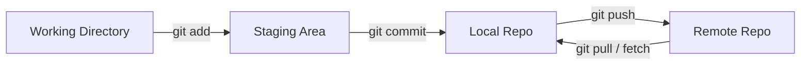
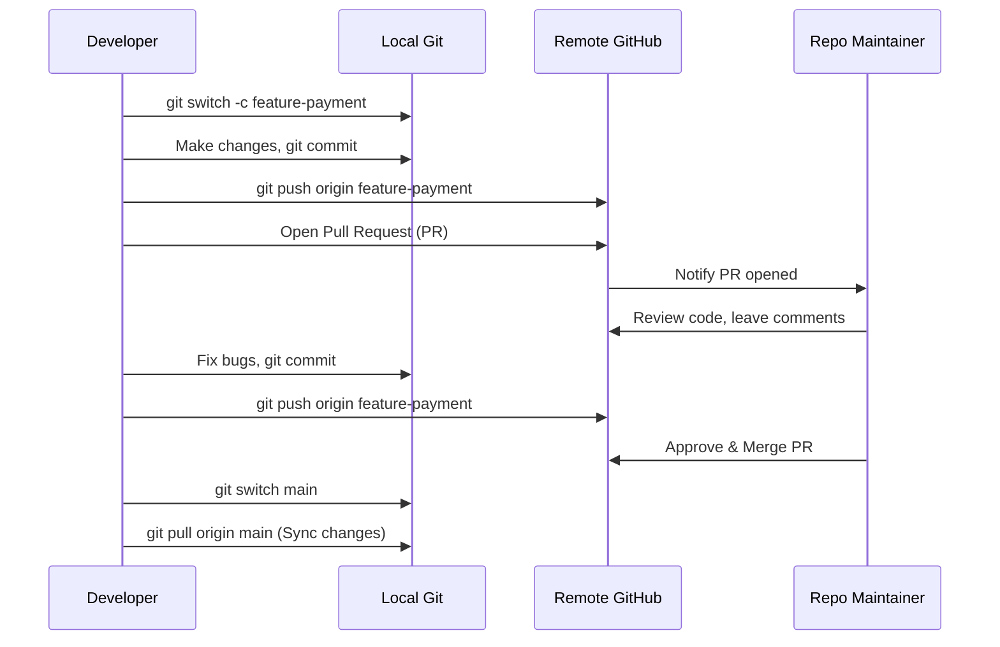

# Master Git & GitHub in One Video! 🚀 Level Up Your Skills Now!

> 🎥 [Master Git & GitHub in One Video!](https://youtu.be/AB3J8ufDYHQ?si=kQDCDTyTnPhct0yF) · 📅 July 13, 2026 · 📚 Software Essentials
> Quick Recall: [Software Essentials — Quick Recall](quick-recall.md#01-git-and-github)

---

## TL;DR

This note provides a comprehensive guide to mastering version control using Git and hosting on GitHub. It covers the core mechanics of Git (its 4 areas, branching, stashing, tagging, and rebasing), collaborative workflows (remotes, SSH auth, pull requests), GUI integrations (GitHub Desktop, VS Code), and modern developer workflows like conventional commits and trunk-based development.

---

## 1. Version Control Fundamentals

### What is a Version Control System (VCS)?

**What is it?**
A software tool that tracks changes to files over time, allowing developers to review history, compare changes, revert to previous states, and collaborate seamlessly on a shared codebase.

**Why does it exist?**
Without a VCS, developers are forced to manually coordinate changes by copying folders (e.g., `project_final_v2_really_final`), emailing zip archives, or overwriting each other's work on shared servers. This leads to code loss, broken builds, and an inability to track who introduced a bug.

**How does it work? (The Linus Torvalds Story)**
In 2005, the Linux kernel development team was collaborating on a massive operating system. They had been using a proprietary tool called BitKeeper, but when the free licensing terms were revoked, Linus Torvalds (the creator of Linux) became frustrated with existing VCS options. He spent a few days in April 2005 writing a brand new, distributed version control system called **Git**. 

Git was designed to be fast, reliable, fully distributed, and capable of handling massive codebases like the Linux kernel without requiring a central server for every operation.

---

### Centralized vs. Distributed VCS

VCS architectures fall into two primary categories:

| Type | Architecture | Pros | Cons |
|---|---|---|---|
| **Centralized VCS** (e.g., SVN, CVS) | A single central server contains all versioned files. Clients check out files from this central location. | Easier to understand; administrator has absolute control over access. | Single point of failure (if server goes down, no one can commit, branch, or view history). High latency as every operation requires a network connection. |
| **Distributed VCS** (e.g., Git, Mercurial) | Every developer's local machine has a full clone of the repository, including its complete history and branch metadata. | Works offline; operations are near-instantaneous; highly reliable; no single point of failure. | Slightly steeper learning curve; initial clone of large repositories can take time. |

**Mental Model / Analogy:**
* **Centralized VCS:** A single shared whiteboard in an office. If the office doors are locked (offline), or the whiteboard is erased (server crash), no one can see or write anything.
* **Distributed VCS:** Every developer has their own identical notepad containing the entire history of the whiteboard drawings. They can sketch on their notepad offline and sync up with others when they meet.

---

## 2. Git vs. GitHub

A common source of confusion for beginners is the difference between Git and GitHub:

* **Git:** A local, open-source command-line tool that manages version control on your machine. It turns local directories into versioned repositories (`.git`).
* **GitHub:** A cloud-based hosting service and web application for Git repositories. It provides a visual interface, issue trackers, pull request tools, and access controls.

**Mental Model / Analogy:**
* **Git is to GitHub** as **Video Recording is to YouTube**. 
* You record videos locally using camera software (Git) and upload them to a hosting platform to share with the world (GitHub).

---

## 3. Installation & Configuration

### Installation Commands

* **Windows:** Download the installer from the official [Git Website](https://git-scm.com/) and run the executable.
* **macOS (via Homebrew):**
  ```bash
  brew install git
  ```
* **Debian/Ubuntu Linux:**
  ```bash
  sudo apt-get update
  sudo apt-get install git
  ```

---

### Global User Identity Configuration

Before making commits, you must configure your identity so that your contributions are properly attributed:

```bash
# Configure username globally
git config --global user.name "John Doe"

# Configure email globally
git config --global user.email "johndoe@example.com"
```

**Interview / Exam Angle:**
* **Question:** Why does Git require you to configure a user name and email immediately after installation?
* **Answer:** Git commits are immutable history logs. Every commit embeds the author's name and email to establish accountability, permitting team members to identify who wrote or modified a line of code.

---

## 4. How Git Works Under the Hood

### The Four Areas of Git

When working with Git, files move through four logical states/locations:



1. **Working Directory (Workspace):** The folder containing your actual files on disk. Changes here are untracked or modified but not yet staged.
2. **Staging Area (Index):** A preparation phase. A virtual file that lists the changes that will be included in the next commit snapshot.
3. **Local Repository (`.git` database):** The local storage directory containing all committed snapshots, branch history, and references.
4. **Remote Repository (GitHub):** The shared repository hosted on a network server (e.g., GitHub) used for collaboration.

---

### The `.git` Folder

**What is it?**
A hidden directory created at the root of a project when you initialize Git. It contains all database objects, reference pointers (refs), configurations, hooks, and commit logs.

**Why does it exist?**
It is the heart of Git. Instead of scattering tracking databases across files, Git keeps all version control database records isolated inside this hidden folder.

**How does it work?**
If you delete the `.git` folder, your project reverts to a standard unversioned folder, and all commit history is lost. Never modify the files inside `.git` manually.

---

## 5. Hands-on Git Basics

### Core Lifecycle Commands

```bash
# Initialize a new local Git repository
git init

# View the status of files in your working directory and staging area
git status

# Stage a specific file for the next commit
git add index.html

# Stage all changes (new, modified, deleted) in the current directory recursively
git add .

# Record the staged changes as a new snapshot in the local repository
git commit -m "feat: implement initial homepage layout"

# View the full commit history
git log

# View a compact, single-line version of the commit history
git log --oneline

# Unstage a file while keeping its changes in the working directory
git restore --staged index.html
```

**Interview / Exam Angle:**
* **Question:** What is the difference between `git add <file>` and `git commit`?
* **Answer:** `git add` moves changes from the working directory to the staging area to build the upcoming snapshot. `git commit` takes that staged snapshot and permanently registers it as an immutable node in the repository's history log.

---

## 6. Ignoring Files & Folder Tracking

### Ignoring Files (`.gitignore`)

**What is it?**
A text file placed in your project root containing patterns of files and directories that Git should ignore and never track.

**Why does it exist?**
To prevent committing sensitive environment files (e.g., API keys, passwords), bulky build dependencies (e.g., `node_modules/`), compiled binaries, or OS temp files.

**How does it work?**
Add patterns to `.gitignore`:

```text
# Ignore sensitive environment files
.env

# Ignore build artifacts folder
build/
dist/

# Ignore all log files
*.log
```

---

### Tracking Empty Folders (`.gitkeep`)

**What is it?**
A convention (not a Git feature) where developers add an empty file named `.gitkeep` inside empty directories they want Git to track.

**Why does it exist?**
Git tracks *files*, not empty directory folders. If a folder is empty, Git will ignore it entirely during a commit.

**Code Example:**
```bash
# Create an empty directory
mkdir uploads

# Force Git to track this directory by adding an empty file
touch uploads/.gitkeep
git add uploads/.gitkeep
git commit -m "chore: track empty uploads directory"
```

---

## 7. Branching & Merging

### Branching Mechanics

**What is a branch?**
A branch is a lightweight, movable pointer to a specific commit. The default branch is typically named `main` or `master`.

**Why does it exist?**
To allow developers to work on new features, bug fixes, or experiments in isolation without disrupting the stable `main` production codebase.

**How does it work?**
The `HEAD` pointer always points to the active branch you are currently working on.

```bash
# List all local branches (active branch marked with *)
git branch

# Create a new branch named 'feature-auth'
git branch feature-auth

# Switch to the 'feature-auth' branch (moves HEAD)
git switch feature-auth

# Shortcut: Create and switch to a new branch in one command
git switch -c feature-analytics
```

---

### Merging Branches

Once work on a feature branch is complete and verified, it is merged back into the base branch (e.g., `main`):

```bash
# Step 1: Switch to the target branch (base)
git switch main

# Step 2: Merge the feature branch into main
git merge feature-auth
```

**Types of Merges:**
1. **Fast-forward merge:** If `main` has not diverged (no new commits were added to it since the feature branch split), Git simply moves the pointer of `main` forward to the latest commit of the feature branch.
2. **3-Way merge (Merge Commit):** If both `main` and the feature branch have new, divergent commits, Git performs a 3-way merge using a common ancestor and creates a new "merge commit" combining both histories.

---

## 8. Merge Conflicts

### Understanding conflicts

**What is it?**
An event that occurs when two branches make conflicting edits to the exact same lines of a file, and Git cannot automatically determine which version is correct.

**Why does it exist?**
Git protects code integrity. Instead of silently overwriting someone's work, Git pauses the merge and asks the developer to manually reconcile the differences.

**How to resolve conflicts:**
When a conflict occurs, Git embeds conflict markers in the affected files:

```html
<<<<<<< HEAD
<h1>Welcome to Our Store (Main Branch)</h1>
=======
<h1>Welcome to Electronic Store (Feature Branch)</h1>
>>>>>>> feature-ui
```

* `<<<<<<< HEAD` points to your current branch's code.
* `=======` divides the conflicting versions.
* `>>>>>>> feature-ui` points to the incoming branch's code.

**Resolution Steps:**
1. Open the file and decide which code to keep (or combine both).
2. Delete the conflict markers (`<<<<<<<`, `=======`, `>>>>>>>`).
3. Stage the resolved files: `git add <file>`.
4. Finalize the merge: `git commit -m "merge: resolve feature-ui conflict"`.

---

## 9. Stashing in Git

### Stashing State Management

**What is it?**
A command that temporarily shelves (stashes) your uncommitted working directory changes (both staged and unstaged) so you have a clean workspace, allowing you to switch branches or apply hotfixes.

**Why does it exist?**
If you have half-finished code and need to urgently switch branches to fix a production bug, Git won't let you switch if your changes conflict with the target branch. Stashing clears your workspace without forcing a premature commit.

**Stashing Commands:**
```bash
# Save uncommitted changes to a temporary stack
git stash

# List all stashed changes
git stash list

# Re-apply the most recent stash and remove it from the stack
git stash pop

# Re-apply the most recent stash but keep it in the stack
git stash apply

# Delete a specific stash from the stack (e.g., stash@{0})
git stash drop stash@{0}

# Delete all stashes in the stack
git stash clear
```

---

## 10. Git Tags

### Tagging Releases

**What is it?**
A permanent pointer to a specific commit, representing a specific release point or milestone (e.g., `v1.0.0`). Unlike branches, tags do not move when new commits are added.

**Types of Tags:**
1. **Lightweight Tag:** Simply a pointer to a specific commit (like a branch that doesn't change).
2. **Annotated Tag:** Stored as full objects in the Git database. They include the creator's name, email, date, a tagging message, and GPG signing options.

```bash
# Create a lightweight tag
git tag v1.0.0-lw

# Create an annotated tag (Recommended for releases)
git tag -a v1.0.0 -m "Release version 1.0.0 containing user auth"

# List all tags
git tag

# Push tags to remote repository
git push origin --tags
```

---

## 11. Git Rebase

### Rebase vs. Merge

Rebase rewrites commit history by applying local commits on top of another branch, maintaining a linear history.

```
Merge Workflow (Creates non-linear commits & merge commit):
      A---B---C (feature)
     /         \
D---E-----------F (main)

Rebase Workflow (Rewrites commits for linear timeline):
D---E---A'---B'---C' (feature / main merged linearly)
```

**Core Commands:**
```bash
# Rebase feature branch onto main
git switch feature-auth
git rebase main
```

**Interview / Exam Angle:**
* **Question:** What is the Golden Rule of Rebasing?
* **Answer:** **Never rebase commits that have been pushed to a public repository.** Rebasing rewrites history (changes commit hashes). If others are working on those commits, it will disrupt their local environments and cause synchronization issues.

---

### Interactive Rebase (Squashing Commits)

You can clean up local commits before pushing using interactive rebasing:

```bash
# Interactively rebase the last 3 commits
git rebase -i HEAD~3
```

In the editor, you can change `pick` to `squash` (or `s`) to combine multiple commits into a single clean commit.

---

## 12. GitHub Hosting & Authentication

### Managing Remotes & SSH Authentication

Instead of entering your username and password for every remote interaction, configure SSH keys:

```bash
# Generate a new SSH keypair
ssh-keygen -t ed25519 -C "johndoe@example.com"

# Copy public key to clipboard (Windows CLI example)
cat ~/.ssh/id_ed25519.pub | clip
# For macOS: pbcopy < ~/.ssh/id_ed25519.pub
```
*Paste this copied public key into GitHub Settings -> SSH and GPG keys.*

```bash
# Add a remote repository pointer named 'origin'
git remote add origin git@github.com:username/repo.git

# View configured remote connections
git remote -v

# Push local main branch to remote (setting default upstream)
git push -u origin main

# Fetch changes from remote database without merging them locally
git fetch

# Pull changes from remote and merge them into the active branch
git pull
```

---

## 13. Tool Integration

### GitHub Desktop & VS Code Integration

While command-line proficiency is essential, GUI tools speed up everyday tasks:

1. **GitHub Desktop:**
   - Provides visual interfaces for staging lines/files.
   - Manages SSH authentication automatically upon logging in with your GitHub credentials.
   - Supports visual branch switching, synchronization, and merge conflict resolution.
2. **VS Code Git Integration:**
   - **Source Control Tab (Ctrl+Shift+G):** Lists changed files, lets you stage individual lines or files (click `+`), and type commit messages.
   - **Side-by-Side Diff View:** Shows additions (green) and deletions (red) side-by-side.
   - **Timeline Pane:** Shows local file history commits.

---

## 14. Scenario: Multi-User Collaboration & Pull Requests (PRs)

Collaborative development utilizes the **Pull Request (PR)** workflow:



**Merges options on GitHub:**
* **Merge Commit:** All commits from the feature branch are added to the main branch history alongside a merge commit.
* **Squash and Merge:** Combines all commits from the PR into a single commit on the main branch, maintaining a cleaner history.
* **Rebase and Merge:** Re-applies the PR commits onto main linearly without a merge commit.

---

## 15. Modern Best Practices

### Conventional Commits

Commit messages should follow standard structures to enable automated changelog generation:

`[type]([optional scope]): [description]`

* `feat`: A new feature (e.g., `feat(auth): add google sign-in`).
* `fix`: A bug fix (e.g., `fix(api): resolve memory leak on user query`).
* `docs`: Documentation changes.
* `style`: Styling changes that do not affect code logic.
* `refactor`: Code reorganization that neither fixes a bug nor adds a feature.
* `chore`: Maintenance tasks, dependencies updates (e.g., `chore: bump uvicorn package`).

---

### Branch Naming Conventions

* Use lower-case names separated by hyphens.
* Prefix naming:
  - `feature/` or `feat/` for new features (e.g., `feature/payment-gateway`).
  - `bugfix/` or `fix/` for bug fixes.
  - `hotfix/` for critical production fixes.
  - `chore/` for updates.

---

## Added Context

### Trunk-Based Development vs. Git Flow

Modern AI startups and fast-paced engineering teams prefer **Trunk-Based Development** over traditional **Git Flow**:

* **Git Flow:** Utilizes long-lived branches (`main`, `develop`, `feature/`, `release/`, `hotfix/`). Features sit on branches for weeks, resulting in massive, complex merge conflicts when eventually combined.
* **Trunk-Based Development:** All developers merge small, verified changes directly into the `main` branch multiple times a day. Features are hidden behind **Feature Flags** (toggles in code) if they are not yet ready for users. This prevents merge conflicts and accelerates shipping cycles.

---

## Practice Check

1. Explain the difference between `git merge` and `git rebase`. Under what scenario is it dangerous to run a rebase?
2. If you create an empty folder called `assets/icons`, why won't it show up in `git status`, and how do you resolve this?
3. A developer has committed a API key to their local repository. They then create a `.gitignore` and add `.env` to it. Will Git stop tracking the environment file? Explain your answer.
4. Write down the commands to create a new branch named `feature/openai-integration`, switch to it, make a change, stash the change, switch back to `main`, apply the stash, and drop it.
